# 跳转

### 方法1

<a href="#a的name">跳到A</a> 

```html
<a href="#a的name">跳到A</a> 


<span name = "a的name">这是A</span>
```

<span name = "a的name">这是A</span>

### 方法2

[跳转到方法1](#方法1)

```
[跳转到方法1](#方法1)
[显示的文字](# + 标题名)
```


# 下标

- 下标：n<sub>3</sub>
- 上标：n<sup>3</sup>

## 内联公式    $ctrl+M$


$\Rightarrow$ [csdn](https://blog.csdn.net/weixin_43444930/article/details/119791074)

# mac回删

第一种：按 delete 键，实现 Windows 键盘上退格键的功能，也就是删除光标之前的一个字符（默认）；

第二种：按 fn+delete 键，删除光标之后的一个字符；

第三种：按 option+delete 键，删除光标之前的一个单词（英文有效）；

第四种：结合第二种，按住fn+option+delete，删除光标之后的一个单词；

# 

# typora快捷键mac markdown语法

[toc]


enter是硬回车，作为一段分隔的标志。
shift+enter是软回车，可以视觉上分段，但在设置段落格式的时候word仍作为一段处理。

shift+enter是换行 标志是向下的箭头
enter是换段 标志是下左箭头

# 一、标题

typora快捷键

`⌘1～6`分别是6～1级标题

------

# 二、字体

```undefined
**这是加粗的文字**  ⌘B
*这是倾斜的文字*  ⌘I
***这是斜体加粗的文字***  ⌘U
~~这是加删除线的文字~~  ⌃⇧`
```

效果如下：

**这是加粗的文字**
*这是倾斜的文字*
***这是倾斜加粗的文字***
~~这是加删除线的文字~~


------

# 三、引用

```ruby
>这是引用的内容
>>这是引用的内容
>>>>>>>>>>这是引用的内容
```

效果如下：

> 这是引用的内容
>
> > 这是引用的内容
> >
> > > > > > > > > > 这是引用的内容

# 四、分割线

```undefined
---
----
***
*****
```

效果如下：
可以看到，显示效果是一样的。

------

------

------

------

# 五、图片

语法：

```bash
*（图片缺失：图片地址 ''图片title''）*

图片alt就是显示在图片下面的文字，相当于对图片内容的解释。
图片title是图片的标题，当鼠标移到图片上时显示的内容。title可加可不加
```

示例：

```cpp

```

md文件中图片的永久存储方法：图床、cdn、文件夹。

# 六、超链接

语法：

```csharp
[超链接名](超链接地址 "超链接title")
title可加可不加
⌘ K
```

示例：

```csharp
[简书](http://jianshu.com)
[百度](http://baidu.com)
```

效果如下：

[简书](https://www.jianshu.com/u/1f5ac0cf6a8b)
[百度](https://links.jianshu.com/go?to=http%3A%2F%2Fbaidu.com)

注：Markdown本身语法不支持链接在新页面中打开，貌似简书做了处理，是可以的。别的平台可能就不行了，如果想要在新页面中打开的话可以用html语言的a标签代替。

```xml
<a href="超链接地址" target="_blank">超链接名</a>

示例
<a href="https://www.jianshu.com/u/1f5ac0cf6a8b" target="_blank">简书</a>
```

------

# 七、列表

**无序列表**

语法：
无序列表用 - + * 任何一种都可以

```undefined
- 列表内容
+ 列表内容
* 列表内容

注意：- + * 跟内容之间都要有一个空格
```

效果如下：

- 列表内容
- 列表内容
- 列表内容

**有序列表**

语法：
数字加点


```undefined
1. 列表内容
2. 列表内容
3. 列表内容

注意：序号跟内容之间要有空格
```

效果如下：

1. 列表内容
2. 列表内容
3. 列表内容

**列表嵌套**

**上一级和下一级之间敲三个空格即可**

- 一级无序列表内容
  - 二级无序列表内容
  - 二级无序列表内容
  - 二级无序列表内容
  
- 一级无序列表内容

  ​	1.

  1. 二级有序列表内容
  2. 二级有序列表内容
  3. 二级有序列表内容

1. 一级有序列表内容
   - 二级无序列表内容
   - 二级无序列表内容
   - 二级无序列表内容
2. 一级有序列表内容
   1. 二级有序列表内容
   2. 二级有序列表内容
   3. 二级有序列表内容

------

# 表格

语法：

```ruby
表头|表头|表头
---|:--:|---:
内容|内容|内容
内容|内容|内容

第二行分割表头和内容。
- 有一个就行，为了对齐，多加了几个
文字默认居左
- 两边加：表示文字居中
- 右边加：表示文字居右
注：原生的语法两边都要用 | 包起来。此处省略
```

示例：

```ruby
姓名|技能|排行
--|:--:|--:
刘备|哭|大哥
关羽|打|二哥
张飞|骂|三弟
```

效果如下：

| 姓名 | 技能 | 排行 |
| ---- | :--: | ---: |
| 刘备 |  哭  | 大哥 |
| 关羽 |  打  | 二哥 |
| 张飞 |  骂  | 三弟 |

# 代码

语法：
单行代码：代码之间分别用一个反引号包起来

```go
    `代码内容`
```

代码块：代码之间分别用三个反引号包起来，且两边的反引号单独占一行


```go
(```)
  代码...
  代码...
  代码...
(```)
```

> 注：为了防止转译，前后三个反引号处加了小括号，实际是没有的。这里只是用来演示，实际中去掉两边小括号即可。

示例：

单行代码

```go
`create database hero;`
```

代码块

```kotlin
(```)
    function fun(){
         echo "这是一句非常牛逼的代码";
    }
    fun();
(```)
```

效果如下：

单行代码

```
create database hero;
```

代码块

```kotlin
function fun(){
  echo "这是一句非常牛逼的代码";
}
fun();
```

# mermaid

- `->` 表示实心箭头
- `->>`表示空心箭头
- `-->` 表示虚线箭头
- `-->>`表示空心箭头

## 时序图

sequence可以创建没有连接的对象

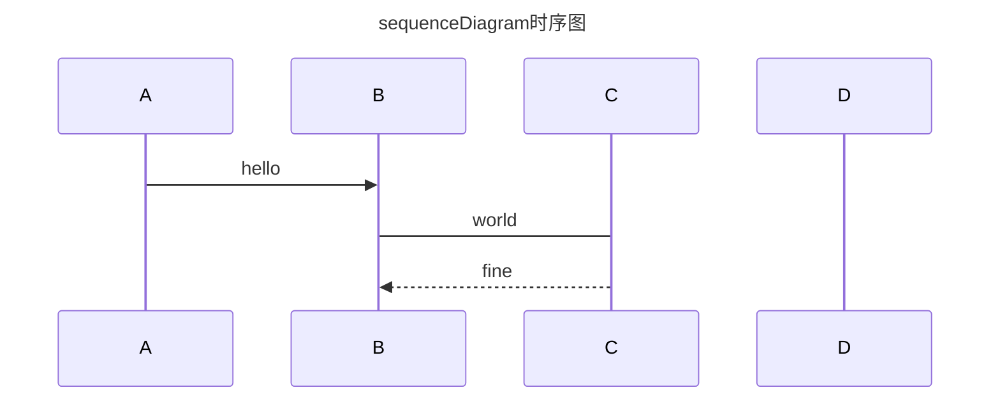

## [流程图](https://blog.csdn.net/weixin_44360592/article/details/109526990)

### 方向

- TB - top to bottom
- TD - top-down/ same as top to bottom
- BT - bottom to top
- RL - right to left
- LR - left to right

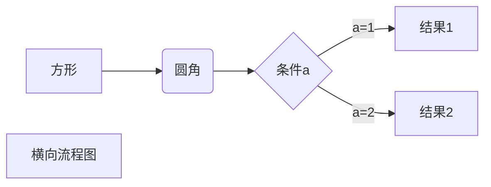


### 连接方式

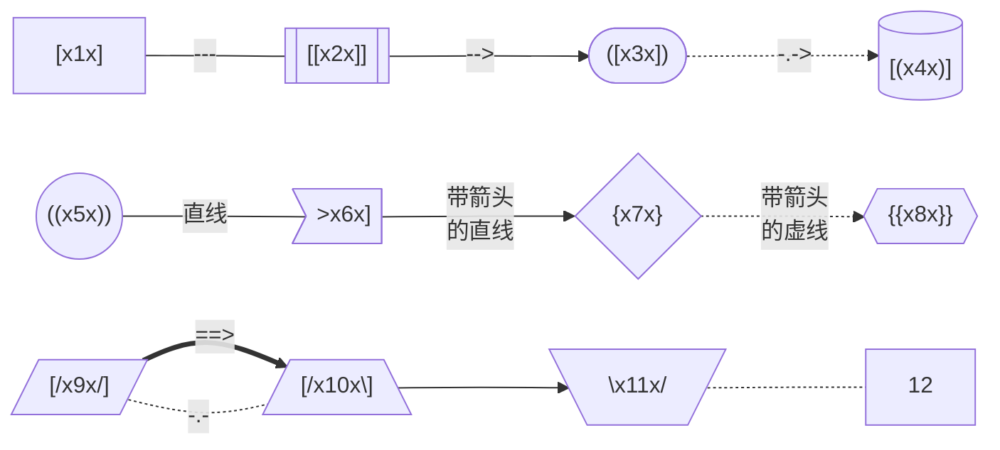


### 自定义风格

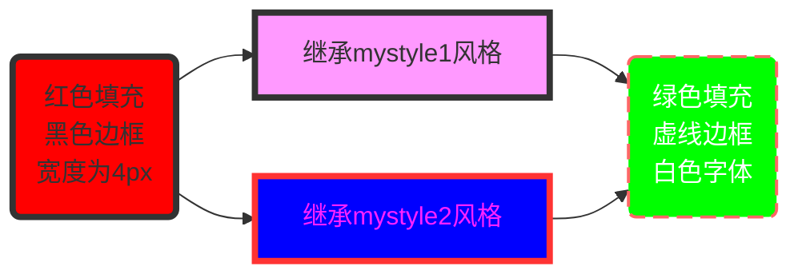


### flowchart图

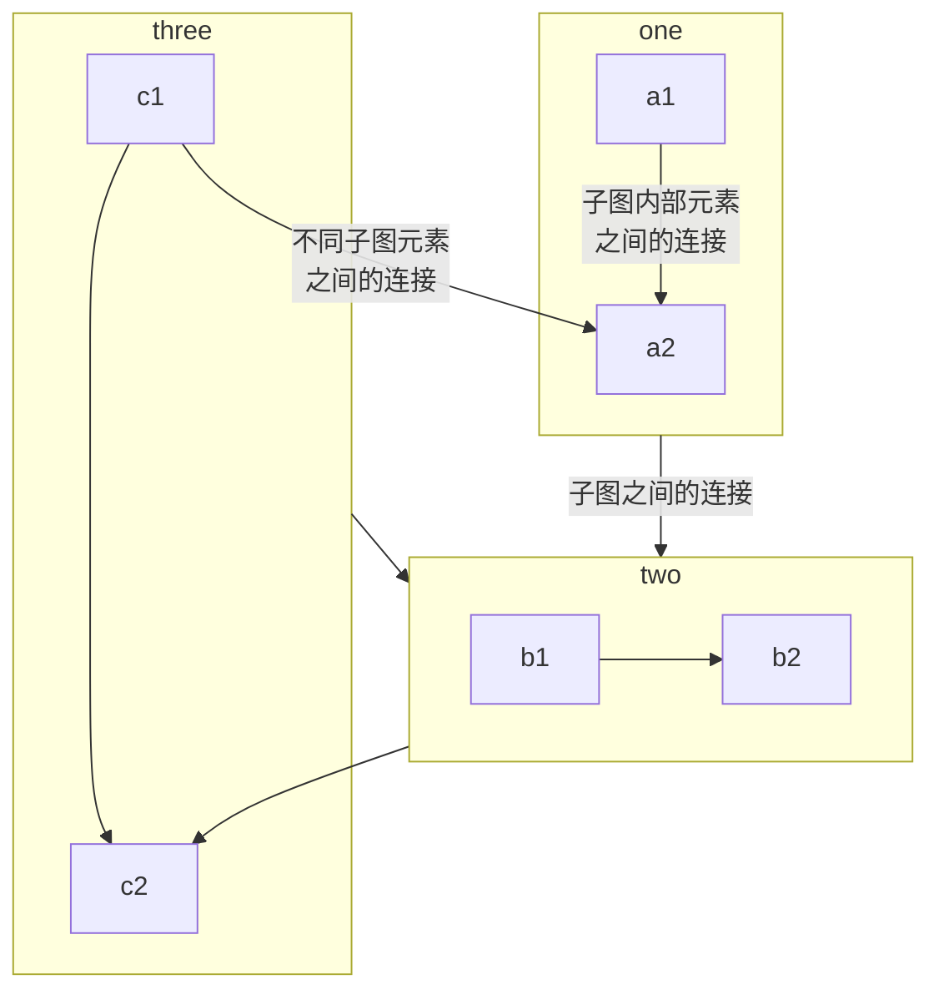

### 状态图stateDiagram

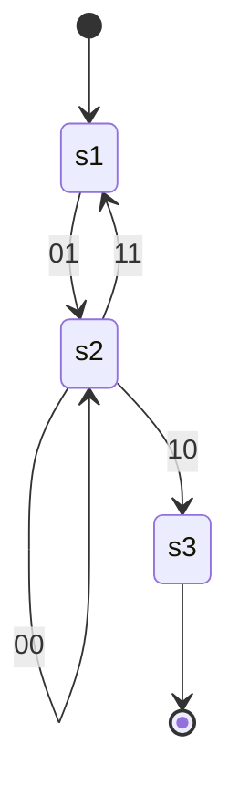

### 甘特图

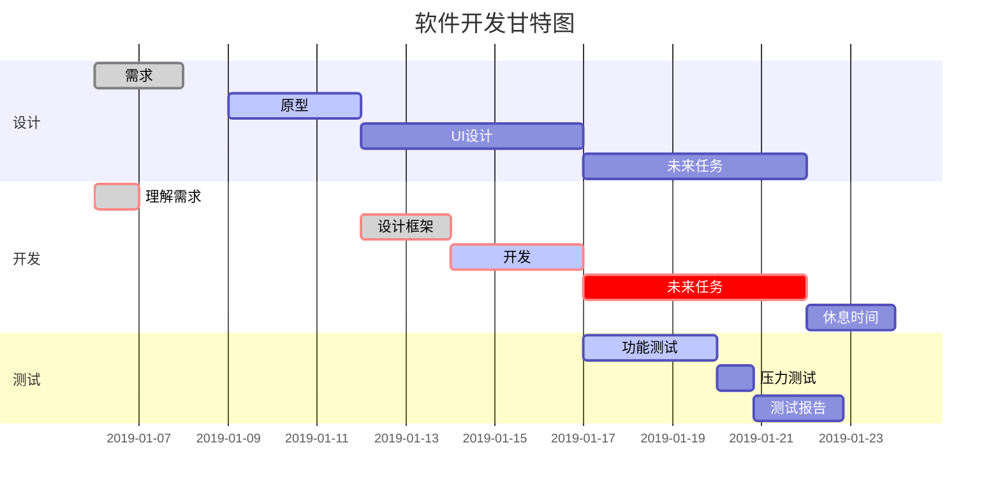

### graph图

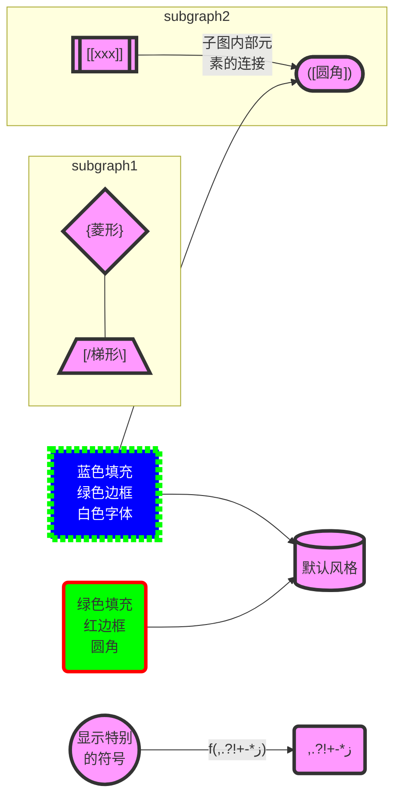
### 饼图

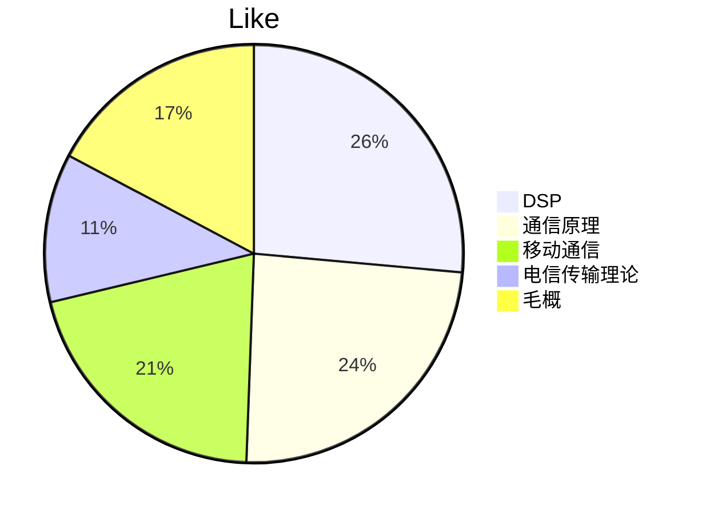

### 类图

箭头

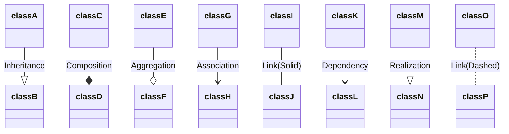


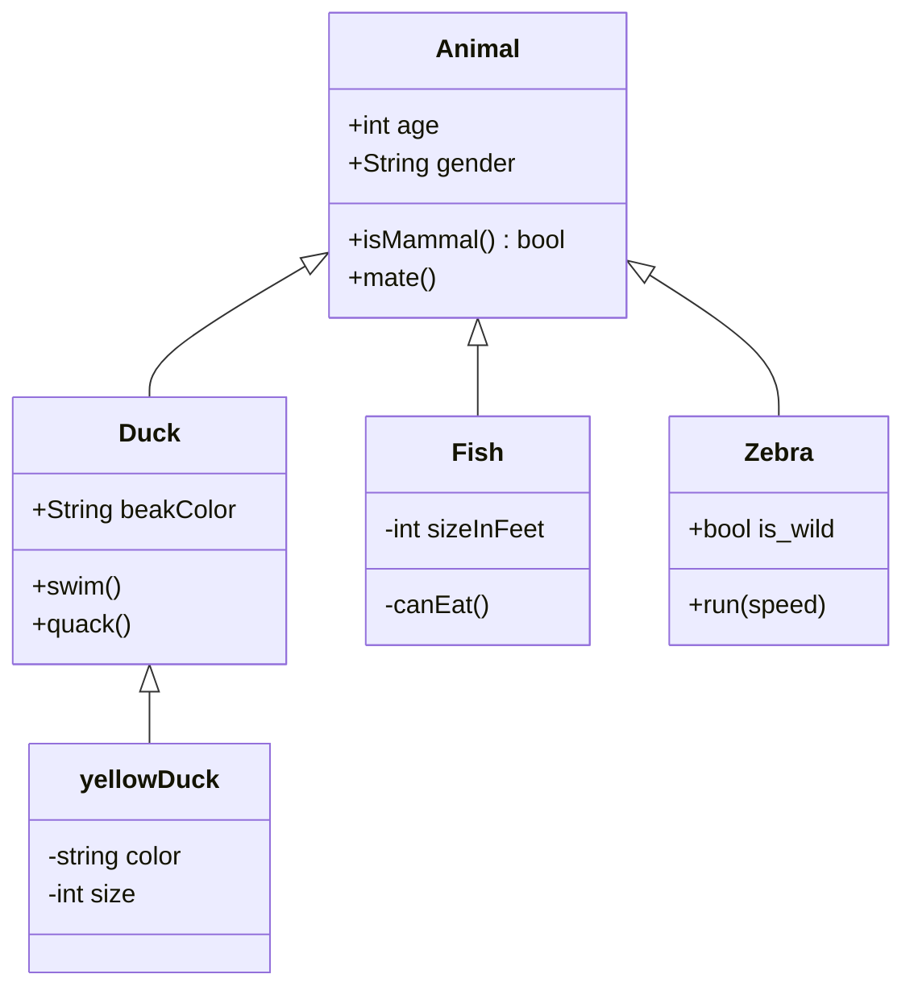

类注释

<<Interface>> To represent an Interface class：接口类
<<abstract>> To represent an abstract class：抽象类
<<Service>> To represent a service class：服务类
<<enumeration>> To represent an enum：枚举类

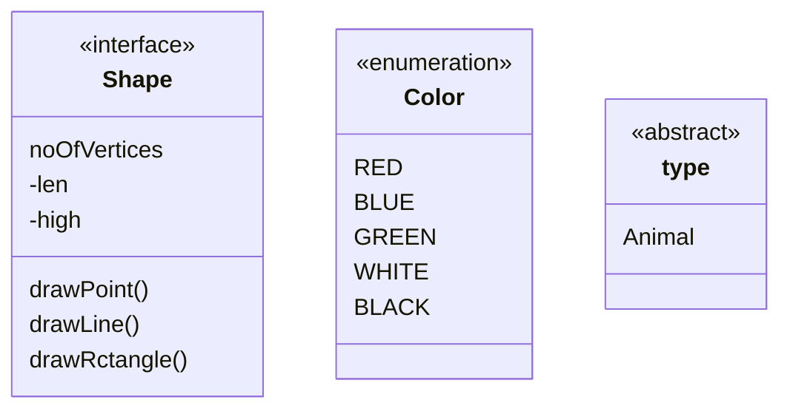

```flow
st=>start: 开始
op=>operation: My Operation
cond=>condition: Yes or No?
e=>end
st->op->cond
cond(yes)->e
cond(no)->op
&```
```


# 添加目录

文档开头添加`[toc]`

# Markdown 实现页面内部跳转

先定义要跳转的锚点

 <span id = "anchor">锚点</span>
1
2
注: id是您随意取的,当然必须是唯一的.

跳转

[锚点](#anchor)
1
2
注: []内是要填转的按钮显示的文字,小括号内#后面是跟的id值.因为跳转是根据id跳的.
————————————————
版权声明：本文为CSDN博主「大大大大大桃子」的原创文章，遵循CC 4.0 BY-SA版权协议，转载请附上原文出处链接及本声明。
原文链接：https://blog.csdn.net/soindy/article/details/50426362